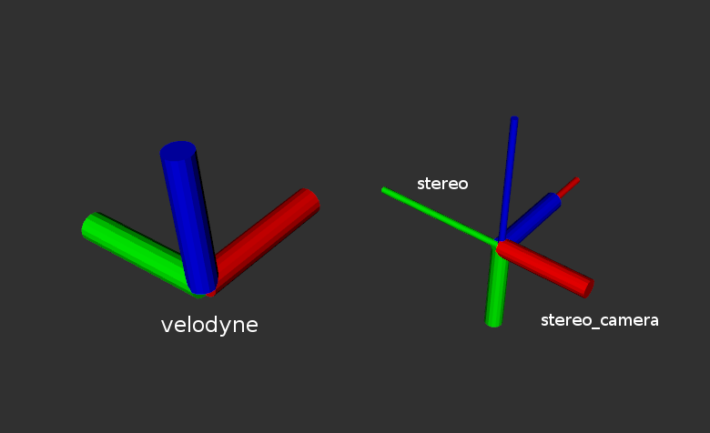
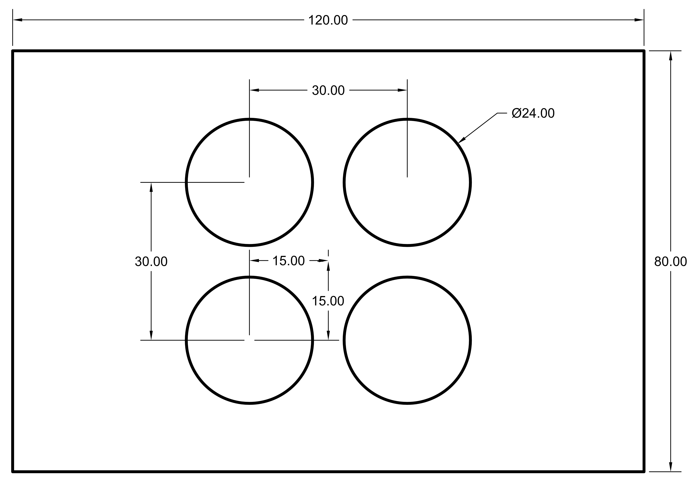

# velo2cam_calibration [](http://build.ros.org/job/Kdev__velo2cam_calibration__ubuntu_xenial_amd64/8/)

The *velo2cam_calibration* software implements an Automatic Calibration algorithm for Lidar-Stereo camera setups \[1\]. This software is provided as a ROS package.

Package developed at [Intelligent Systems Laboratory](http://www.uc3m.es/islab), Universidad Carlos III de Madrid.


# Nodes #
## stereo_pattern ##
### Subscribed Topics ###
*cloud2* ([sensor_msgs/PointCloud2](http://docs.ros.org/api/sensor_msgs/html/msg/PointCloud2.html))

&nbsp;&nbsp;&nbsp;&nbsp;Stereo camera point cloud containing points belonging to edges in the left image

*cam_plane_coeffs* ([pcl_msgs::ModelCoefficients](http://docs.ros.org/api/pcl_msgs/html/msg/ModelCoefficients.html))

&nbsp;&nbsp;&nbsp;&nbsp;Coefficients of the calibration target plane model
### Published Topics ###
*/stereo_pattern/centers_cloud* ([velo2cam_calibration::ClusterCentroids](http://docs.ros.org/kinetic/api/velo2cam_calibration/html/msg/ClusterCentroids.html))

&nbsp;&nbsp;&nbsp;&nbsp;Target circles centers obtained from stereo camera data

### Parameters ###
## laser_pattern ##
### Subscribed Topics ###
*cloud1* ([sensor_msgs/PointCloud2](http://docs.ros.org/api/sensor_msgs/html/msg/PointCloud2.html))

&nbsp;&nbsp;&nbsp;&nbsp;LIDAR pointcloud
### Published Topics ###
*/laser_pattern/centers_cloud* ([velo2cam_calibration::ClusterCentroids](http://docs.ros.org/kinetic/api/velo2cam_calibration/html/msg/ClusterCentroids.html))

&nbsp;&nbsp;&nbsp;&nbsp;Target circles centers obtained from LIDAR data
### Parameters ###
## velo2cam_calibration ##
### Subscribed Topics ###
*~cloud1* ([velo2cam_calibration::ClusterCentroids](http://docs.ros.org/kinetic/api/velo2cam_calibration/html/msg/ClusterCentroids.html))

&nbsp;&nbsp;&nbsp;&nbsp;Target circles centers obtained from LIDAR data

*~cloud2* ([velo2cam_calibration::ClusterCentroids](http://docs.ros.org/kinetic/api/velo2cam_calibration/html/msg/ClusterCentroids.html))

&nbsp;&nbsp;&nbsp;&nbsp;Target circles centers obtained from stereo camera data

*~cloud3* ([sensor_msgs/PointCloud2](http://docs.ros.org/api/sensor_msgs/html/msg/PointCloud2.html))

&nbsp;&nbsp;&nbsp;&nbsp;Original LIDAR pointcloud
### Published Topics ###
TF containing the transformation between both sensors ([see TF info in ROS Wiki](http://wiki.ros.org/tf))

The node broadcasts the TF transformation between *velodyne* and *stereo* frames.
The fixed transformation between *stereo_camera* and *stereo* is published by a static broadcaster in *stereo_pattern.launch*.
The picture below shows the three coordinate frames:



**Note**: Additionally, a .launch file called *calibrated_tf.launch* containing the proper TF broadcasters is created in the */launch* folder of the *velo2cam_calibration* package so
you can use the calibration just executing:

```roslaunch velo2cam_calibration calibrated_tf.launch```

### Parameters ###

# Usage #
Some sample .launch files are provided in this package. The simplest way to launch the algorithm is by running the three main ROS nodes as follows:

```roslaunch velo2cam_calibration laser_pattern.launch```

```roslaunch velo2cam_calibration stereo_pattern.launch```

```roslaunch velo2cam_calibration velo2cam_calibration.launch```

**Note**: In order to test the algorithm with a proper ground truth, a simulator environment in Gazebo is provided [here](https://github.com/beltransen/velo2cam_gazebo)


# Calibration target details #
The following scheme shows the real size of the calibration target used by this algorithm. Measurements are given in centimeters (cm).



**Note:** Other size may be used for convenience. If so, please configure nodes parameters accordingly.

# Citation #
\[1\] Guindel, C., Beltrán, J., Martín, D. and García, F. (2017). Automatic Extrinsic Calibration for Lidar-Stereo Vehicle Sensor Setups. *IEEE International Conference on Intelligent Transportation Systems (ITSC), 674–679*.

Pre-print available [here](https://arxiv.org/abs/1705.04085).
