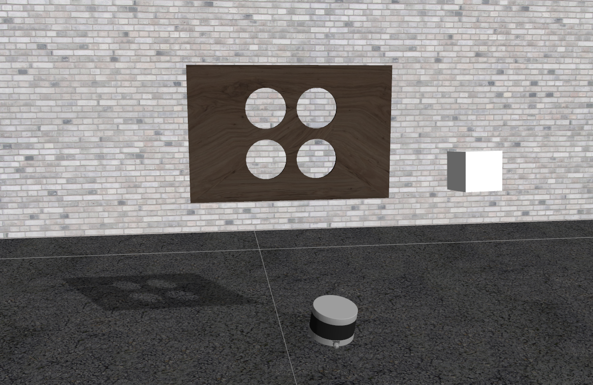

# velo2cam_calibration [](http://build.ros.org/job/Kdev__velo2cam_calibration__ubuntu_xenial_amd64/8/)

The *velo2cam_calibration* software implements an Automatic Calibration algorithm for Lidar-Stereo camera setups [1]. This software is provided as a ROS package.

Package developed at [Intelligent Systems Laboratory](http://www.uc3m.es/islab), Universidad Carlos III de Madrid.



# Nodes #
## stereo_pattern ##
### Subscribed Topics ###
cloud1 (sensor_msgs/PointCloud2)
   Laser pointcloud
### Published ###
### Parameters ###
## laser_pattern ##
### Subscribed Topics ###
cloud1 (sensor_msgs/PointCloud2)
   Laser pointcloud
### Published Topics ###
### Parameters ###
## velo2cam_calibration ##
### Subscribed Topics ###
cloud1 (velo2cam_calibration::ClusterCentroids)
cloud2 (velo2cam_calibration::ClusterCentroids)
### Published Topics ###
tf relating both sensors
### Parameters ###

# Usage #
Some sample .launch files are provided in this package. The simplest way to launch the algorithm is by running the three main ROS nodes as follows:

```roslaunch velo2cam_calibration lidar_pattern.launch```

```roslaunch velo2cam_calibration stereo_pattern.launch```

```roslaunch velo2cam_calibration velo2cam_calibration.launch```

Note: In order to test the algorithm with a proper ground truth, a simulator environment in Gazebo is provided [here](https://github.com/beltransen/velo2cam_gazebo)

# Citation #
[1] *"Automatic Extrinsic Calibration for Lidar-Stereo Vehicle Sensor Setups"* submitted to *International Conference on Intelligent Transportation Systems (ITSC) 2017*.

For citation details, please contact Jorge Beltran (jbeltran AT ing.uc3m DOT es) or Carlos Guindel (cguindel AT ing.uc3m DOT es).
